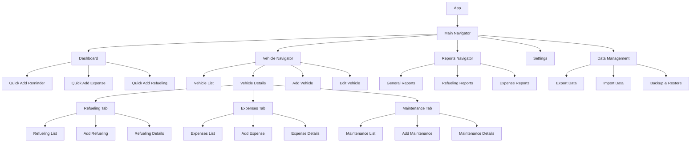

# BLAP_Car - Design Plan

## 1. Overview

This document outlines the design plan for creating BLAP_Car, a comprehensive vehicle fleet management system for personal or business use. The app allows users to track refueling, expenses, maintenance, routes, checklists, and reminders for their vehicles. Upon opening the app, users are presented with a history dashboard showing their recent vehicle activities.

## 1.1 Benefits of Using BLAP_Car

BLAP_Car helps users answer important questions about their vehicles:

- Do you know how much you spend on your vehicle?
- Do you know when to schedule the next service?
- Do you know which fuel is most efficient for your vehicle?

Users can register, organize, and track all information about their cars, motorcycles, trucks, buses, or fleet anytime and anywhere through their smartphone or tablet. The app provides detailed reports and graphs to help users make informed decisions about their vehicle management. By maintaining an accurate history of all expenses and maintenance, users can better plan for future costs and avoid unexpected expenses.

## 1.2 Home Screen Dashboard

Upon opening the app, users are presented with a history dashboard showing their recent vehicle activities. This dashboard provides quick access to the most important information and recent entries for all vehicles in the fleet. The home screen also includes quick action buttons for adding reminders, expenses, and refueling records.

### Quick Action Buttons
- **Add Reminder**: Opens the expense reminder creation screen
- **Add Expense**: Opens the expense entry screen
- **Add Refueling**: Opens the refueling entry screen

## 1.3 Vehicle Data

Each vehicle in BLAP_Car maintains the following information:
- Name
- Make
- Model
- License Plate
- Fuel Tank Volume (liters)
- Year
- VIN (Chassis)
- RENAVAM (Brazilian vehicle registration number)

## 2. Key Features

Based on research, the BLAP_Car app provides the following core functionalities:

### Refueling Management
Track fuel consumption, costs, and efficiency for multiple fuel types. The app allows users to fill in refueling data in real-time, giving more agility to management. From the information filled in, charts and reports are generated that allow access to data such as average consumption, costs per kilometer traveled, kilometers traveled, and more. This feature helps users quickly identify if there are any issues with the vehicle and if maintenance is needed.

### Expense Tracking
Record all vehicle-related expenses. BLAP_Car allows users to have total control over vehicle expenses by registering taxes, insurance, fines, parking, and other expenses. All information is displayed in various reports, which can be divided by date, type, or period. The visualization of information through charts facilitates understanding, making it clearer the evolution of expenses with your vehicle.

### Maintenance Management
Schedule and track preventive and corrective maintenance with various service types. Oil changes, brake checks, tire replacements, filters, air conditioning cleaning - all these services can be easily viewed in the app. At the moment you take the vehicle out of the mechanic, you can enter the services performed, keeping the history of expenses and maintenance always updated.

### Checklists
Create and manage vehicle inspection checklists to ensure vehicles are road-ready and identify maintenance needs. Users can create custom forms to perform vehicle inspections, ensuring the vehicle is ready to face the roads. This reduces the risk of mechanical problems in remote or unknown locations. The vehicle checklist helps identify and correct safety issues before they become dangerous. Items such as brakes, tires, lights, and seat belts can be regularly checked to ensure the vehicle is safe to operate.

### Reminders
Set up notifications for maintenance, payments, and other events based on date or mileage. Scheduling preventive maintenance is a fundamental activity in vehicle management. With the help of the app, users can configure reminders to control regular services such as oil changes, tire replacement, inspection, and revision, scheduling by kilometer or date. This way, users can plan ahead and avoid expenses with future problems.

#### Expense Reminders
Users can configure expense-based reminders with the following options:

- **Expense Type Selection** (required): Choose the type of expense for the reminder

- **One-time Reminders** (at least one option required):
  - **By Kilometer**: Set a specific odometer reading to trigger the reminder
  - **By Date**: Set a specific date to trigger the reminder

- **Recurring Reminders** (at least one option required):
  - **By Kilometer**: Set a recurring odometer interval (e.g., every 5000 km)
  - **By Time Period**: Set a recurring time interval in days, months, or years

### Fleet Management
Manage multiple vehicles and drivers.

### Reporting
Generate detailed reports and graphs on vehicle performance and costs. Visualize information clearly and track the evolution of information related to your vehicle through reports and graphs available in the app. This feature facilitates the analysis of expenses and vehicle performance, separated by date or type, assisting in decision-making. Access information for each vehicle, separated by date and modules. Visualize fleet performance through graphs that assist in decision-making.

The app provides three main types of reports:

#### General Reports
- Records count per period (default: all periods)
- Total cost, per day, per km
- Total distance, daily average
- Automatic charts

#### Refueling Reports
- Records count per period (default: all periods)
- Total cost, per day, per km
- Fuel: total volume, overall average
- Average: last, highest, lowest
- Fuel type (gasoline, ethanol, etc.):
  - Total cost, total volume
  - Average (km/l): last, highest, lowest
  - Cost/km: last, lowest, highest
- Automatic charts

#### Expense Reports
- Records count per period (default: all periods)
- Cost: total, per day, per km
- Automatic charts

### Data Export/Import
Export and import data for backup and migration purposes. This functionality ensures that the history of expenses and maintenance is always preserved, allowing users to maintain an accurate record of all vehicle-related activities and costs over time. Data can be exported and imported in CSV and XLSX formats.

## 2.6 Expense Entry Requirements

When adding expenses, the app will collect the following information:

- **Date** (required, automatically retrieved)
- **Time** (automatically retrieved)
- **Odometer** (required, but shows the last odometer reading next to it. Does not allow entering a value less than the last)
- **Expense Type** (required)
- **Location** (GPS, automatically retrieved)
- **Driver**
- **Payment Method**
- **Observation**
- **Attach File**

## 2.7 Refueling Entry Requirements

When adding refueling records, the app will collect the following information:

- **Date** (required, automatically retrieved)
- **Time** (automatically retrieved)
- **Odometer** (required, but shows the last odometer reading next to it. Does not allow entering a value less than the last)
- **Fuel Type** (required): Select from the supported fuel types
- **Price per Liter** (required):
  - Enter value manually
  - Enter either total cost OR liters, with the other field automatically calculated
- **Full Tank** (checkbox)
- **Previous Refueling Missing** (checkbox)
- **Gas Station** (automatically retrieved using GPS)
- **Driver**
- **Payment Method**
- **Observation**
- **Attach File**

## 2.1 Supported Fuel Types

- Gasoline (Regular)
- Ethanol
- Diesel
- LPG (Liquefied Petroleum Gas)
- CNG (Compressed Natural Gas)
- Electric

## 2.2 Expense Categories

- Fine
- Licensing
- Taxes (IPVA/DPVAT)
- Toll
- Insurance

## 2.4 Distance Units

- Kilometers (km)
- Miles (mi)

## 2.5 Expense Types

- Repair/Maintenance
- Parking
- Financing
- Taxes (IPVA/DPVAT)
- Car Wash
- Licensing
- Traffic Fine
- Toll
- Review
- Insurance

## 3. Technology Stack

### Mobile Application
- **Frontend**: Flutter (Android only)
- **State Management**: Provider or Riverpod
- **Navigation**: Flutter Navigator 2.0
- **UI Components**: Flutter Material 3 Components
- **Local Storage**: SQLite with Flutter SQLite plugin
- **Settings Management**: Flutter Shared Preferences
- **File Storage**: Flutter File System (user-selected folder)
- **Permissions**: Flutter Permissions Plugin (for file storage access)
- **Internationalization**: Flutter i18n with intl package
- **Data Export/Import**: Flutter Excel package for XLSX, csv_reader for CSV
- **Date/Time Handling**: Flutter built-in DateTime with intl package
- **Charts/Graphs**: Flutter Charts or FL Chart
- **Error Handling**: Flutter Error Handling and Logging
- **QR/Barcode Scanning**: Flutter Barcode Scanner plugin
- **GPS Location**: Flutter Geolocator plugin
- **File Attachment**: Flutter File Picker plugin
- **Android Specific Features**: 
  - Android Notifications for reminders
  - Android Share API for sharing exported files
  - Android Document Picker for file import
  - Android File Provider for secure file access

### Backend Services
- No backend services required (offline-only application)

## 4. Architecture

```mermaid
graph TD
    A[BLAP_Car App (Flutter)] --> B[Local SQLite Database]
    A --> C[Android File System]
    A --> D[Android Services]
    A --> E[Home Screen Widgets]
    A --> F[QR/Barcode Scanner]
    
    B[(Vehicle Data Storage)]
    C[(User-selected Folder)]
    D[Notifications/Permissions]
    E[Quick Refueling Entry & Flex Calculator]
    F[Receipt Scanning]
```

## 5. Database Design

### Core Entities

```mermaid
erDiagram
    VEHICLE ||--o{ REFUELING : has
    VEHICLE ||--o{ MAINTENANCE : requires
    VEHICLE ||--o{ EXPENSE : incurs
    VEHICLE ||--o{ EXPENSE_REMINDER : has
    MAINTENANCE ||--o{ REMINDER : triggers
    EXPENSE ||--o{ REMINDER : triggers
    
    VEHICLE {
        int id PK
        string name
        string make
        string model
        int year
        string plate
        float fuel_tank_volume
        string vin
        string renavam
        float initial_odometer
        datetime created_at
    }
    
    REFUELING {
        int id PK
        int vehicle_id FK
        datetime date
        datetime time
        float odometer
        float liters
        float price_per_liter
        float total_cost
        string fuel_type /* Gasoline, Ethanol, Diesel, LPG, CNG, Electric */
        string station
        boolean full_tank
        boolean previous_refueling_missing
        string driver
        string payment_method
        string observation
        string attachment_path
    }
    
    EXPENSE {
        int id PK
        int vehicle_id FK
        string type /* Repair/Maintenance, Parking, Financing, Taxes, Car Wash, Licensing, Traffic Fine, Toll, Review, Insurance */
        string description
        float cost
        datetime date
        datetime time
        float odometer
        string location
        string driver
        string payment_method
        string observation
        string attachment_path
        string category
    }
    
    EXPENSE_REMINDER {
        int id PK
        int vehicle_id FK
        string expense_type
        boolean is_recurring
        boolean trigger_km_enabled
        float trigger_km
        boolean trigger_date_enabled
        datetime trigger_date
        boolean recurring_km_enabled
        int recurring_km_interval
        boolean recurring_time_enabled
        int recurring_days_interval
        int recurring_months_interval
        int recurring_years_interval
        datetime created_at
        datetime updated_at
    }
    
    MAINTENANCE {
        int id PK
        int vehicle_id FK
        string type /* Oil Change, Battery, Lights, Tires, Inspection */
        string description
        float cost
        datetime date
        datetime next_date
        int odometer
        string status
    }
    
    REMINDER {
        int id PK
        int vehicle_id FK
        string type
        string description
        datetime date
        boolean completed
    }
    
    DRIVER {
        int id PK
        string name
        string license_number
        datetime license_expiry_date
        string contact_info
        datetime created_at
    }
    
    VEHICLE ||--o{ DRIVER : assigned_to
```

## 6. Mobile App Structure

### Main Modules

1. **Vehicle Management Module**
   - Add/edit/delete vehicles
   - Vehicle details view
   - Vehicle list/dashboard

2. **Refueling Module**
   - Log new refueling
   - Refueling history
   - Fuel efficiency statistics

3. **Expense Module**
   - Record expenses
   - Expense categories
   - Expense reports

4. **Maintenance Module**
   - Schedule maintenance
   - Maintenance history
   - Maintenance alerts

5. **Fleet Management Module**
   - Manage multiple vehicles
   - Driver management
   - Fleet-wide reporting

7. **Reports Module**
   - General reports
   - Refueling reports
   - Expense reports

8. **Data Management Module**
   - Export data to file (CSV, XLSX)
   - Import data from file (CSV, XLSX)
   - Backup and restore functionality

9. **Checklist Module**
   - Create and manage vehicle inspection checklists
   - Custom checklist templates
   - Checklist completion tracking

### Android-Specific UI Components

- **Material Design 3 Components**: Using Flutter widgets for consistent Android look and feel with Material 3 guidelines
- **Floating Action Button**: For primary actions like adding new vehicles, refuelings, etc.
- **Bottom Navigation**: For main app sections
- **Android Notifications**: For reminder alerts
- **Native Date/Time Pickers**: For selecting dates and times
- **File Picker**: For importing data files
- **Share Sheet**: For sharing exported files
- **Home Screen Widget**: For quick refueling data entry
- **QR/Barcode Scanner**: For scanning fiscal receipts and product codes
- **Expense Reminder UI**: For configuring expense-based reminders with the following components:
  - Expense type selection dropdown (required)
  - One-time reminder section with km and date checkboxes and inputs
  - Recurring reminder section with km and time period checkboxes and inputs
  - Validation indicators to ensure at least one trigger is selected for each reminder type
- **Home Screen Quick Actions**: For adding reminders, expenses, and refueling from the dashboard
- **GPS Location Retrieval**: For automatic location capture
- **File Attachment UI**: For attaching files to expenses
- **Refueling Entry UI**: For recording refueling data with the following components:
  - Automatic date/time fields
  - Odometer input with validation against last reading
  - Fuel type selection dropdown
  - Price per liter input
  - Total cost OR liters input (with automatic calculation of the other)
  - Full tank checkbox
  - Previous refueling missing checkbox
  - Gas station location (automatically retrieved using GPS)
  - Driver selection
  - Payment method selection
  - Observation text field
  - File attachment functionality

### Component Hierarchy



## 7. Local Data Access Layer

Since the application is offline-only, all data operations will be performed directly on the local SQLite database using Flutter plugins. The following data access patterns will be implemented:

### Vehicle Data Access
- `getAllVehicles()` - List all vehicles
- `createVehicle(vehicle)` - Create new vehicle
- `getVehicleById(id)` - Get vehicle details
- `updateVehicle(id, vehicle)` - Update vehicle
- `deleteVehicle(id)` - Delete vehicle

### Refueling Data Access
- `getRefuelingsByVehicleId(vehicleId)` - List vehicle refuelings
- `addRefueling(vehicleId, refueling)` - Add refueling
- `getRefuelingById(id)` - Get refueling details
- `updateRefueling(id, refueling)` - Update refueling
- `deleteRefueling(id)` - Delete refueling
- `getLastOdometerReading(vehicleId)` - Get last odometer reading for vehicle
- `validateOdometerReading(vehicleId, odometer)` - Validate odometer reading is not less than last reading
- `calculateLitersFromTotalCost(pricePerLiter, totalCost)` - Calculate liters from price per liter and total cost
- `calculateTotalCostFromLiters(pricePerLiter, liters)` - Calculate total cost from price per liter and liters

### Expense Data Access
- `getExpensesByVehicleId(vehicleId)` - List vehicle expenses
- `addExpense(vehicleId, expense)` - Add expense
- `getExpenseById(id)` - Get expense details
- `updateExpense(id, expense)` - Update expense
- `deleteExpense(id)` - Delete expense
- `getLastOdometerReading(vehicleId)` - Get last odometer reading for vehicle
- `validateOdometerReading(vehicleId, odometer)` - Validate odometer reading is not less than last reading

### Maintenance Data Access
- `getMaintenancesByVehicleId(vehicleId)` - List vehicle maintenances
- `addMaintenance(vehicleId, maintenance)` - Add maintenance
- `getMaintenanceById(id)` - Get maintenance details
- `updateMaintenance(id, maintenance)` - Update maintenance
- `deleteMaintenance(id)` - Delete maintenance

### Data Export/Import Functions
- `exportAllData(format)` - Export all data in specified format (CSV/XLSX)
- `exportVehicleData(vehicleId, format)` - Export specific vehicle data
- `importData(filePath, format)` - Import data from file
- `createBackup()` - Create backup file
- `restoreFromBackup(filePath)` - Restore from backup file

### Expense Reminder Functions
- `createExpenseReminder(reminder)` - Create new expense reminder
- `getExpenseRemindersByVehicleId(vehicleId)` - List vehicle expense reminders
- `updateExpenseReminder(id, reminder)` - Update expense reminder
- `deleteExpenseReminder(id)` - Delete expense reminder
- `evaluateExpenseReminders(vehicleId, currentOdometer)` - Evaluate reminders based on odometer
- `validateExpenseReminder(reminder)` - Validate reminder configuration (at least one trigger selected for one-time reminders, at least one trigger selected for recurring reminders)

### Report Generation Functions
- `generateGeneralReport(vehicleId, startDate, endDate)` - Generate general report with records count, total cost, distance metrics
- `generateRefuelingReport(vehicleId, startDate, endDate)` - Generate refueling report with fuel metrics and efficiency statistics
- `generateExpenseReport(vehicleId, startDate, endDate)` - Generate expense report with cost breakdown
- `getRecordsCountByPeriod(vehicleId, entityType, startDate, endDate)` - Get count of records for a specific entity type within a date range
- `getTotalCostByPeriod(vehicleId, entityType, startDate, endDate)` - Calculate total cost for a specific entity type within a date range
- `getCostPerDay(vehicleId, entityType, startDate, endDate)` - Calculate average cost per day for a specific entity type
- `getCostPerKm(vehicleId, entityType, startDate, endDate)` - Calculate cost per kilometer for a specific entity type
- `getTotalDistanceByPeriod(vehicleId, startDate, endDate)` - Calculate total distance traveled within a date range
- `getDailyDistanceAverage(vehicleId, startDate, endDate)` - Calculate daily distance average
- `getFuelMetricsByType(vehicleId, fuelType, startDate, endDate)` - Get fuel-specific metrics (total cost, total volume, averages)
- `getFuelEfficiencyStats(vehicleId, fuelType, startDate, endDate)` - Get fuel efficiency statistics (km/l averages)
- `getCostPerKmStats(vehicleId, fuelType, startDate, endDate)` - Get cost per kilometer statistics
- `getDistancePerDay(vehicleId, startDate, endDate)` - Calculate average distance traveled per day
- `getDistancePerPeriod(vehicleId, startDate, endDate)` - Calculate distance traveled per period

## 8. Development Phases

### Phase 1: Core Infrastructure (Weeks 1-2)
- Set up development environment
- Create project structure
- Set up database schema
- Implement local data access layer
- Implement Android-specific permissions (file storage)
- Create unit tests for data access layer

### Phase 2: Vehicle Management (Weeks 3-4)
- Create unit tests for vehicle CRUD operations
- Implement vehicle CRUD operations
- Create mobile UI for vehicle management with Flutter Material Design 3
- Implement data validation
- Implement Android-specific UI components
- Create UI tests for vehicle management

### Phase 3: Refueling & Expense Tracking (Weeks 5-6)
- Create unit tests for refueling and expense tracking
- Implement refueling tracking functionality
- Implement expense tracking functionality
- Create mobile UI for refueling and expenses
- Add data visualization for fuel efficiency
- Implement Android notifications for reminders
- Implement QR/Barcode scanning for expense entry
- Implement automatic date/time retrieval for expenses
- Implement odometer validation for expenses
- Implement GPS location retrieval for expenses
- Implement file attachment functionality for expenses
- Create UI tests for refueling and expense tracking

### Phase 4: Maintenance Management (Weeks 7-8)
- Create unit tests for maintenance scheduling
- Implement maintenance scheduling
- Create maintenance tracking features
- Add reminder system with Android notifications
- Implement preventive maintenance alerts
- Implement expense reminder functionality
- Create UI tests for maintenance management

### Phase 5: Advanced Features (Weeks 9-10)
- Create unit tests for advanced features
- Implement route tracking
- Add reporting functionality with charts
- Create dashboard with statistics
- Implement data export/import functionality (CSV and XLSX formats)
- Implement Android file sharing for exported files
- Implement home screen widget for refueling data entry
- Implement multilingual support (Portuguese Brazil and English)
- Create UI tests for advanced features

### Phase 6: Testing & Deployment (Weeks 11-12)
- Perform unit testing
- Conduct integration testing
- Execute user acceptance testing
- Test Android-specific features (notifications, file sharing, permissions)
- Test home screen widget functionality
- Create release builds
- Set up automated GitHub Actions deployment
- Create documentation

## 9. Security Considerations

- Sanitize all user inputs to prevent injection attacks
- Validate all data before storing in the local database
- Implement proper error handling to avoid information leakage
- Regularly update dependencies to patch security vulnerabilities
- Ensure proper file permissions for data export/import operations

## 10. Testing Strategy

### Unit Testing
- Test all business logic components
- Test local data access functions
- Test database operations
- Test Flutter widgets and components

### Integration Testing
- Test SQLite database integration
- Test file system operations
- Test Android-specific integrations (notifications, permissions)
- Test Flutter plugin integrations

### End-to-End Testing
- Test complete user workflows
- Test offline functionality
- Test Android-specific features (file sharing, notifications)
- Test Flutter UI components

### Performance Testing
- Test app performance with large datasets
- Test file export/import performance
- Test Android notification delivery
- Test Flutter rendering performance

### Android-Specific Testing
- Test on different Android versions (API levels)
- Test on different screen sizes and densities
- Test with various Android permissions scenarios
- Test file operations with different storage configurations
- Test home screen widget functionality
- Test widget behavior with different Android launchers
- Test APK installation from GitHub Releases
- Test expense reminder notifications

## 11. Data Export/Import Functionality

### Export Features
- Export all vehicle data to CSV and XLSX format
- Export individual vehicle records
- Export reports and statistics
- Save exported files to user-selected folder

### Import Features
- Import data from CSV and XLSX files
- Data validation during import process
- Conflict resolution for duplicate records
- Partial import capabilities

### Implementation Details
- Add export/import UI in the mobile app
- Implement data serialization/deserialization for CSV and XLSX formats
- Add file handling capabilities for user-selected folders
- Ensure data integrity during transfer

## 12.1 Reporting Requirements

### General Reports
- Records count per period (default: all periods)
- Total cost, per day, per km
- Total distance, daily average
- Automatic charts

### Refueling Reports
- Records count per period (default: all periods)
- Total cost, per day, per km
- Fuel: total volume, overall average
- Average: last, highest, lowest
- Fuel type (gasoline, ethanol, etc.):
  - Total cost, total volume
  - Average (km/l): last, highest, lowest
  - Cost/km: last, lowest, highest
- Automatic charts

### Expense Reports
- Records count per period (default: all periods)
- Cost: total, per day, per km
- Automatic charts

## 12.2 Data Backup Strategy

### Backup Features
- Automated daily backups
- Manual backup creation
- Backup file encryption
- Multiple backup locations (local storage, cloud storage)
- Backup file versioning

### Implementation Details
- Implement backup scheduling service
- Add backup UI in settings
- Integrate with cloud storage providers (Google Drive, Dropbox)
- Implement backup file encryption
- Create backup restoration functionality

## 13. Multilingual Support

### Supported Languages
- Portuguese (Brazil)
- English

### Implementation Details
- Use Flutter i18n with intl package for internationalization
- Create language resource files for each supported language
- Implement language selection in app settings
- Provide multilingual support for all UI elements and dialogs

## 14. Android Home Screen Widgets

### Refueling Data Entry Widget
BLAP_Car will include an Android home screen widget that allows users to quickly enter refueling data without opening the full application. This widget provides a convenient way to log fuel consumption immediately after filling up the tank.

#### Widget Features
- Quick refueling data entry directly from the home screen
- Minimal interface with essential fields only
- Direct integration with the app's database
- Support for all fuel types (Gasoline, Ethanol, Diesel, LPG, CNG, Electric)

#### Widget UI Components
- Vehicle selection dropdown
- Fuel type selection
- Odometer reading input
- Fuel quantity input
- Fuel price per unit input
- Date selection (defaults to current date)
- "Save" button to submit data
- "Open App" button to access full features

#### Implementation Details
- Use Flutter Android Widget API
- Direct database integration without requiring app to be open
- Data validation before saving
- Error handling for offline scenarios
- Localization support matching app language

### Flex Calculator Widget
BLAP_Car will include a Flex Calculator widget that helps users determine which fuel (Gasoline or Ethanol) is more economical for their vehicle.

#### Widget Features
- Calculate fuel economy between Gasoline and Ethanol prices
- Support for both price-based and performance-based calculations
- Quick access to fuel comparison without opening the full app

#### Calculation Methods
1. **Price Comparison (Easier Method)**:
   - Formula: (Ethanol price / Gasoline price) < 0.7
   - If result < 0.7, Ethanol is more economical
   - If result > 0.7, Gasoline is more economical

2. **Performance Comparison (More Accurate)**:
   - Formula: (Ethanol km/l / Gasoline km/l) > 0.7
   - If result > 0.7, Ethanol is more economical
   - If result < 0.7, Gasoline is more economical

#### Widget UI Components
- Current Gasoline price input
- Current Ethanol price input
- "Calculate" button
- Result display showing which fuel is more economical
- "Open App" button for detailed calculations

#### Implementation Details
- Use Flutter Android Widget API
- Implement both calculation methods
- Provide clear visual indication of recommended fuel
- Update calculations in real-time as users enter prices

## 15. Implementation TODO List

### Missing Elements and Improvement Suggestions


#### Suggested Improvements:
- **Enhanced Analytics**: Add anonymous usage analytics to improve the app
- **Fuel Price Tracking**: Integration with fuel price APIs or manual price tracking
- **Vehicle Comparison**: Tools to compare fuel efficiency between different vehicles
- **Maintenance History Templates**: Predefined maintenance schedules for common vehicle types
- **Photo Attachments**: Ability to attach photos to maintenance records and expenses
- **Recurrence Patterns**: Support for recurring expenses (insurance, registration, etc.)
- **Data Visualization Enhancements**: More chart types and customizable dashboards
- **Voice Input**: Voice-to-text for quick data entry
- **Barcode/QR Code Scanning**: Scan receipts and fiscal notes for automatic expense entry
- **Geofencing**: Automatic mileage tracking based on location

These improvements can be considered for future versions after the core functionality is implemented.

## 15.1 App Settings

### Display Settings
- Show average on last refueling (checkbox)
- Date and time format customization
- Currency format customization
- Decimal places display

### Reminder Settings
- Kilometer threshold (display reminder with X km in advance): default 500km
- Day threshold (display reminder with X days in advance): default 30 days
- Best time for notifications: default 08:30
- Refueling notifications (checkbox)
- Tire pressure notifications (checkbox)
- Vibrate on notification (checkbox)

## 15.2 Expense Reminders

### Reminder Configuration Options
- Select expense type for the reminder (required)
- One-time reminders (at least one checkbox must be selected):
  - By kilometer (checkbox with textbox to define km)
  - By date (checkbox with date selection)
- Recurring reminders (at least one checkbox must be selected):
  - By kilometer (checkbox with textbox to define km interval)
  - By time period (checkbox with period selection in days/months/years)

### Implementation Details
- Integrate with existing notification system
- Store reminder configurations in local database
- Implement reminder evaluation logic
- Provide visual feedback for upcoming reminders
- Implement validation logic to ensure at least one trigger is selected for one-time reminders
- Implement validation logic to ensure at least one trigger is selected for recurring reminders

### Core Infrastructure
- [ ] Set up Flutter development environment
- [ ] Create project structure with Android-specific configurations
- [ ] Set up SQLite database schema
- [ ] Implement local data access layer
- [ ] Implement Android file system permissions
- [ ] Implement comprehensive error handling strategy
- [ ] Create unit tests for data access layer

### Vehicle Management
- [ ] Design vehicle data model
- [ ] Implement vehicle CRUD operations
- [ ] Create vehicle list UI with Flutter Material Design 3
- [ ] Create vehicle details UI
- [ ] Create add/edit vehicle forms
- [ ] Implement data validation for vehicle information
- [ ] Create home screen dashboard with quick action buttons
- [ ] Create unit tests for vehicle CRUD operations
- [ ] Create UI tests for vehicle management

### Refueling Tracking
- [ ] Design refueling data model
- [ ] Implement refueling CRUD operations
- [ ] Create refueling list UI with Flutter Material Design 3
- [ ] Create add refueling form with all required fields
- [ ] Implement fuel efficiency calculations
- [ ] Implement automatic date/time retrieval
- [ ] Implement odometer validation (must be >= last odometer reading)
- [ ] Implement GPS location retrieval for gas station
- [ ] Implement fuel type selection
- [ ] Implement price per liter and total cost/liters calculation
- [ ] Implement full tank and previous refueling missing checkboxes
- [ ] Implement payment method selection
- [ ] Implement file attachment functionality
- [ ] Create unit tests for refueling operations
- [ ] Create UI tests for refueling tracking

### Expense Tracking
- [ ] Design expense data model
- [ ] Implement expense CRUD operations
- [ ] Create expense list UI with Flutter Material Design 3
- [ ] Create add expense form with all required fields
- [ ] Implement expense categorization
- [ ] Integrate QR/Barcode scanning for expense entry
- [ ] Implement automatic date/time retrieval
- [ ] Implement odometer validation (must be >= last odometer reading)
- [ ] Implement GPS location retrieval
- [ ] Implement payment method selection
- [ ] Implement file attachment functionality
- [ ] Create unit tests for expense operations
- [ ] Create UI tests for expense tracking

### Maintenance Management
- [ ] Design maintenance data model
- [ ] Implement maintenance CRUD operations
- [ ] Create maintenance list UI with Flutter Material Design 3
- [ ] Create add maintenance form
- [ ] Implement maintenance scheduling
- [ ] Create unit tests for maintenance operations
- [ ] Create UI tests for maintenance management

### Reporting & Dashboard
- [ ] Design reporting data models
- [ ] Implement report generation functions
- [ ] Create general reports UI with Flutter Material Design 3
- [ ] Create refueling reports UI with Flutter Material Design 3
- [ ] Create expense reports UI with Flutter Material Design 3
- [ ] Implement general report generation (records count, total cost, distance metrics)
- [ ] Implement refueling report generation (fuel metrics, efficiency statistics)
- [ ] Implement expense report generation (cost breakdown)
- [ ] Create dashboard with statistics and Flutter Material Design 3
- [ ] Implement charting functionality for all report types
- [ ] Create unit tests for reporting functions

### Fleet Management
- [ ] Design fleet data models (vehicles, drivers)
- [ ] Implement fleet CRUD operations
- [ ] Create fleet management UI with Flutter Material Design 3
- [ ] Implement driver management functionality
- [ ] Create fleet-wide reporting features
- [ ] Implement fleet data validation
- [ ] Create unit tests for fleet management operations
- [ ] Create UI tests for fleet management

### Checklist Management
- [ ] Design checklist data models
- [ ] Implement checklist CRUD operations
- [ ] Create checklist management UI with Flutter Material Design 3
- [ ] Implement checklist template functionality
- [ ] Implement checklist completion tracking
- [ ] Create unit tests for checklist operations
- [ ] Create UI tests for checklist management

### Data Export/Import
- [ ] Implement CSV export functionality
- [ ] Implement XLSX export functionality
- [ ] Implement CSV import functionality
- [ ] Implement XLSX import functionality
- [ ] Create export/import UI with Flutter Material Design 3
- [ ] Implement file handling for user-selected folders
- [ ] Create unit tests for export/import functions

### QR/Barcode Scanning
- [ ] Implement QR code scanning for fiscal receipts
- [ ] Implement barcode scanning for product codes
- [ ] Create scanning UI with Flutter Material Design 3
- [ ] Integrate with expense tracking module
- [ ] Implement data extraction from scanned codes
- [ ] Add manual data correction for scanned information
- [ ] Create unit tests for scanning functionality

### Flex Calculator
- [ ] Implement price-based fuel comparison calculation
- [ ] Implement performance-based fuel comparison calculation
- [ ] Create flex calculator UI with Flutter Material Design 3
- [ ] Add flex calculator to home screen widget
- [ ] Implement real-time calculation updates
- [ ] Create unit tests for calculation functionality

### Data Backup Strategy
- [ ] Implement automated backup scheduling
- [ ] Create manual backup functionality
- [ ] Implement backup file encryption
- [ ] Integrate with cloud storage providers
- [ ] Create backup restoration functionality
- [ ] Add backup settings UI with Flutter Material Design 3
- [ ] Create unit tests for backup functionality

### Android Home Screen Widgets
- [ ] Design refueling data entry widget UI layout following Flutter Material Design 3 guidelines
- [ ] Design flex calculator widget UI layout following Flutter Material Design 3 guidelines
- [ ] Implement refueling data entry widget functionality
- [ ] Implement flex calculator widget functionality
- [ ] Integrate widgets with main app database
- [ ] Implement data validation in widgets
- [ ] Create unit tests for widget functionality

### Multilingual Support
- [ ] Set up Flutter i18n localization
- [ ] Create Portuguese (Brazil) translation files
- [ ] Create English translation files
- [ ] Implement language selection in settings with Flutter Material Design 3
- [ ] Test localization in all UI components

### Dark Theme
- [ ] Implement dark theme following Material Design 3 guidelines
- [ ] Add theme selection in settings
- [ ] Test dark theme across all UI components
- [ ] Create unit tests for theme switching

### Accessibility Features
- [ ] Implement screen reader support
- [ ] Add adjustable text sizes
- [ ] Implement high contrast mode
- [ ] Add voice commands support
- [ ] Test accessibility with assistive technologies

### App Settings
- [ ] Implement display settings (date/time format, currency format, decimals)
- [ ] Implement reminder settings (km threshold, day threshold, notification time)
- [ ] Implement notification preferences
- [ ] Create settings UI with Flutter Material Design 3
- [ ] Add settings to home screen widget configuration
- [ ] Create unit tests for settings functionality

### Expense Reminders
- [ ] Implement expense reminder creation
- [ ] Add expense type selection for reminders (required field)
- [ ] Implement one-time reminders (by km or date) with validation that at least one option is selected
- [ ] Implement recurring reminders (by km or time period) with validation that at least one option is selected
- [ ] Create expense reminder UI with Flutter Material Design 3
- [ ] Integrate with notification system
- [ ] Create unit tests for reminder functionality

### Android-Specific Features
- [ ] Implement Android notifications for reminders
- [ ] Implement Android file sharing
- [ ] Implement Android permissions handling
- [ ] Test Android-specific UI components

### Testing
- [ ] Perform unit testing for all modules
- [ ] Conduct integration testing
- [ ] Execute user acceptance testing
- [ ] Test Android-specific features (notifications, file sharing, permissions)
- [ ] Test home screen widget functionality
- [ ] Create release builds
- [ ] Set up automated GitHub Actions deployment
- [ ] Create documentation

#### Widget UI Components
- Current Gasoline price input
- Current Ethanol price input
- "Calculate" button
- Result display showing which fuel is more economical
- "Open App" button for detailed calculations

#### Implementation Details
- Use Flutter Android Widget API
- Implement both calculation methods
- Provide clear visual indication of recommended fuel
- Update calculations in real-time as users enter prices

### Deployment
- [ ] Generate signed Android APK
- [ ] Set up GitHub Actions workflow
- [ ] Configure automated build triggers
- [ ] Set up GitHub Releases
- [ ] Create user documentation

